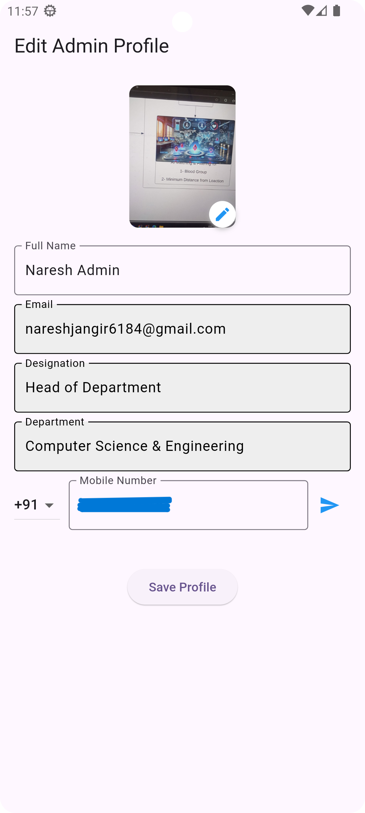
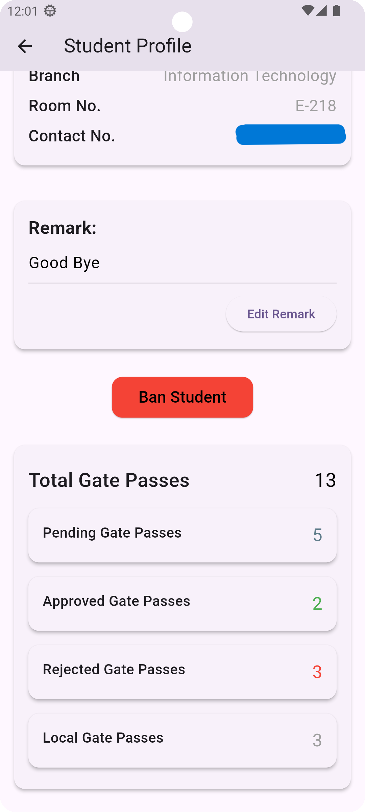

# Gate Pass Automation - Admin App

## Overview

The **Admin App** is a part of the Gate Pass Automation system that allows administrators to efficiently manage gate pass requests from users. It provides features for reviewing, approving, rejecting, and analyzing gate pass trends, ensuring a seamless process for both users and the administration.

## Features

- **User Management:** View and manage user details.
- **Gate Pass Requests:** Approve, reject, and monitor gate pass applications.
- **Categorization:** Requests are categorized into Local, Vacation, Outstation, and Emergency.
- **Trends & Analytics:** Analyze gate pass request trends over different time periods.
- **Export Data:** Generate Excel reports for record-keeping.
- **Search & Filter:** Find students by roll number or apply filters.
- **Student Profile Access:** Admins can view any student's profile, including personal details and gate pass history.
- **Statistics Dashboard:** Visualize key metrics through graphical representations.
- **Admin Management:** Add new admins to the system.

## App Screenshots

| Home Page | Profile Page |
|-----------|-------------|
|  |  |

| Gate Pass Details | Approved Requests |
|-------------------|------------------|
|  |  |

| Rejected Requests | Student Search by Roll No |
|-------------------|--------------------------|
|  |  |

| Student Search by Filters | Student Profile |
|---------------------------|----------------|
|  |  |

| Student Profile Details | Statistics Dashboard |
|-------------------------|----------------------|
|  |  |

| Add New Admin | Features of Admin App |
|--------------|--|
|  |   |


## Tech Stack

- **Framework:** Flutter (Dart)
- **Database:** Firebase Firestore
- **Authentication:** Firebase Authentication
- **Storage:** Firebase Storage 

## Installation

1. Clone the repository:
   ```sh
   git clone https://github.com/naresh6184/Admin_GatePass.git
   ```

2.  Navigate to the project directory:
    ```sh
    cd Admin_gatePass
    ```
    

3. Install dependencies
    ```sh
    flutter pub get
    ```

4. Run the app
    ```sh
    flutter run
    ```

## Firebase Setup
1. Create a Firebase project at [Firebase Console](https://console.firebase.google.com/).
2. Enable **Firestore**, **Authentication**, and **Storage**.
3. Download the `google-services.json` file and place it in `android/app/`.
4. Set up Firebase rules to secure data access.

## Usage
- **Login**: Admins authenticate using their credentials.  
- **Dashboard**: View pending, approved, and rejected gate passes.  
- **Approve/Reject Requests**: Manage requests with a single tap.  
- **Generate Reports**: Export gate pass data as Excel files.  
- **View Student Profiles**: Check any student's profile, gate pass history, and details.  

## Contributing
1. Fork the repository.  
2. Create a feature branch:  
   ```sh
   git checkout -b feature/new-feature
    ```
3. Commit your changes:  
   ```sh
   git commit -m "Add new feature"
    ```
4. Push to branch:  
   ```sh
   git push origin feature/new-feature
    ```
5. Create a pull request.

## License
This project is licensed under the **MIT License**.

---

## Author
Naresh Jangir

Contact: nareshjangir6184@gmail.com

---
